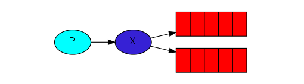
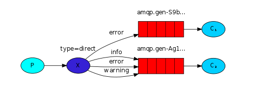
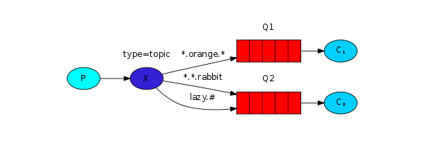

# docker 安装 RabbitMQ
```terminal
docker run -d --hostname my-rabbit --name some-rabbit -p 15671:15671 -p 15672:15672 -p 15691:15691 -p 15692:15692 -p 25672:25672 -p 4369:4369 -p 5671:5671 -p 5672:5672 rabbitmq:3-management
```

# Worker模式介绍
+ 多客户端同时消费一个队列的消息，竞争消费。提高客户端消息消费速度。
+ 补充点1：可以给队列添加一条属性，不再是队列把任务平均分配开给消费者。而是让消费者消费完了后，问队列要新的任务，这样能者多劳。
```java
    // 设置每个消费者同时只能处理一条消息
    channel.basicQos(1);
```
+ 补充点2：接受者接受消息时，可以像下图这样配置消费端手动ACK。
```java
    DeliverCallback deliverCallback = (consumerTag, delivery) -> {
        String message = new String(delivery.getBody(), StandardCharsets.UTF_8);

        log.info(" [x] Received '" + message + "'");
        try {
            doWork(message);
        } finally {
            log.info(" [x] Done");
            //手动确认消息
            channel.basicAck(delivery.getEnvelope().getDeliveryTag(), false);
        }
    };
    channel.basicConsume(TASK_QUEUE_NAME,
        /*手动确认消息 */false,
        deliverCallback,
        consumerTag -> {
        }
    );
```

# 发布订阅模式介绍

## 订阅模型

订阅模型借助一个新的概念：Exchange（交换机）实现，不同的订阅模型本质上是根据交换机(Exchange)的类型划分的。

订阅模型有三种：
+ Fanout（广播模型）: 将消息发送给绑定给交换机的所有队列(因为他们使用的是同一个RoutingKey)。
+ Direct（定向）: 把消息发送给拥有指定Routing Key (路由键)的队列。
+ Topic（通配符）: 把消息传递给拥有 符合Routing Patten(路由模式)的队列。

### 订阅之Fanout模型



这个模型的特点就是它在发送消息的时候，并没有指明`RoutingKey` ，或者说他指定了`RoutingKey`，但是所有的消费者都知道，大家都能接收到消息,就像听广播。

### 订阅之Direct模型



和Fanout模型相似。不同时发送方指定了`RoutingKey`。同时，队列也指定了和`RoutingKey`一样的`BindingKey`。接收者在此队列即可接收到对应消息。

### 订阅之Topic模型



topic模型和direc模型相似。

**区别：Topic模型的队列的`BindingKey`支持正则表达式。**

参考链接：[Messaging Patterns](https://www.enterpriseintegrationpatterns.com/patterns/messaging/CompetingConsumers.html)